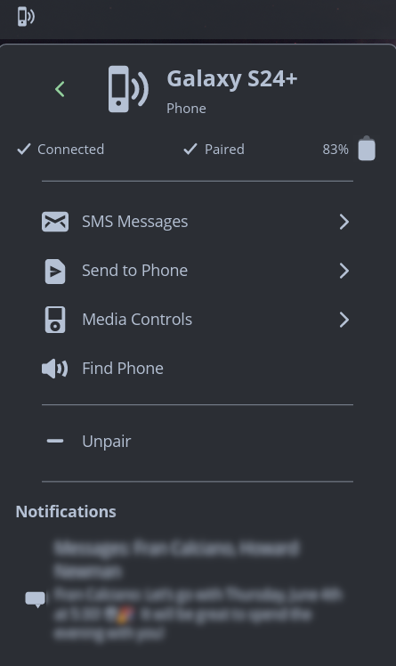
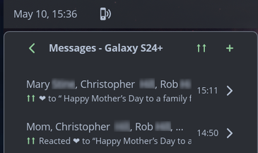
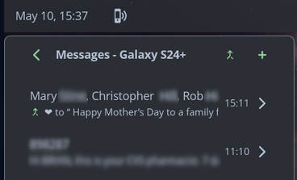

# Connected

A phone connectivity applet for the [COSMIC](https://github.com/pop-os/cosmic-epoch) desktop panel, powered by [KDE Connect](https://kdeconnect.kde.org/).



## Features

- **Device Management** - Pair, unpair, and monitor connected devices (phones, tablets, laptops, desktops)
- **SMS Messaging** - View conversations, reply, and compose new messages with contact lookup
- **Smart SMS Threading** - Automatically merges conversations that iOS reaction-over-SMS splits into multiple threads on Android, with a toggle to disable if the heuristic misfires
- **File Sharing** - Send and receive files and URLs, with desktop notifications
- **Clipboard Sync** - Send clipboard content to your device
- **Notifications** - View and dismiss phone notifications; desktop alerts for SMS and calls (with privacy controls)
- **Battery Status** - Monitor battery level and charging state
- **Media Controls** - Control music playback (play/pause, next/previous, volume)
- **Find My Phone** - Ring or ping your phone to locate it

 ### SMS Reaction-Thread Merging

When someone reacts to an SMS from iOS, Android often files the reaction into a separate thread from the original conversation. Connected detects these split threads and merges them on the desktop side, with a one-click toggle to switch between merged and split views.

  <table>
    <tr>
      <td align="center"><b>Split view</b></td>
      <td align="center"><b>Merged view</b></td>
    </tr>
    <tr>
      <td></td>
      <td></td>
    </tr>
  </table>

## Requirements

Connected requires KDE Connect on both your desktop and Android phone.

**Desktop:**
```sh
# Debian/Ubuntu/Pop!_OS
sudo apt install kdeconnect

# Fedora
sudo dnf install kdeconnect

# Arch
sudo pacman -S kdeconnect
```

**Phone:** Install the KDE Connect app from [Google Play](https://play.google.com/store/apps/details?id=org.kde.kdeconnect_tp) or [F-Droid](https://f-droid.org/packages/org.kde.kdeconnect_tp/).

## Installation

Install Connected from the Applets section of the COSMIC Store.

Alternatively, you can download the latest release from the [Releases](https://github.com/nwxnw/cosmic-ext-connected/releases) page and use the following instructions.

### Flatpak

Install:
```sh
flatpak install --user ./cosmic-ext-connected_*.flatpak
```

Uninstall:
```sh
flatpak uninstall --user io.github.nwxnw.cosmic-ext-connected
```

### Debian/Ubuntu (.deb)

Install:
```sh
sudo apt install ./cosmic-ext-connected_*_amd64.deb
```

Uninstall:
```sh
sudo apt remove cosmic-ext-connected
```

### From source

Requires Rust, [just](https://github.com/casey/just), and system dependencies:

```sh
sudo apt install -y build-essential cmake pkgconf \
  libxkbcommon-dev libwayland-dev libglvnd-dev \
  libexpat1-dev libfontconfig-dev libfreetype-dev \
  libinput-dev libdbus-1-dev libssl-dev
```

```sh
just build-release
sudo just install
```

Then add **Connected** to your COSMIC panel via Settings > Desktop > Panel > Applets.

Uninstall:
```sh
sudo just uninstall
```

## Usage

1. Ensure both devices are on the same network
2. Click the Connected applet in your panel - your phone should appear
3. Click your phone and select "Pair", then accept on your phone
4. **Important:** After pairing, enable the requested permissions in the KDE Connect app on your phone (SMS, Contacts, etc.)

## Configuration

Settings are accessible via the gear icon in the applet. Options include:

- **Show battery percentage** - Display battery level in device list
- **Show offline devices** - Show paired devices that aren't currently connected
- **Show non-mobile devices** - Show desktops and laptops that aren't currently connected
- **Show notifications** - Toggle desktop notifications. Additional notification settings in Notifications Settings page
- **Merge reaction bucket threads** - Enable merging of threads split by iOS reactions
- **File notifications** - Desktop notifications for received files
- **SMS notifications** - Desktop notifications for incoming SMS (with sender/content privacy options)
- **Call notifications** - Desktop notifications for incoming/missed calls (with name/number privacy options)

## Contributing

Contributions welcome! Please submit issues and pull requests.

See `CLAUDE.md` for detailed development documentation.

## License

GNU General Public License v3.0 - see [LICENSE](LICENSE).

## Acknowledgments

- [KDE Connect](https://kdeconnect.kde.org/) - The daemon that makes this possible
- [System76](https://system76.com/) / [libcosmic](https://github.com/pop-os/libcosmic) - The COSMIC desktop and UI toolkit
